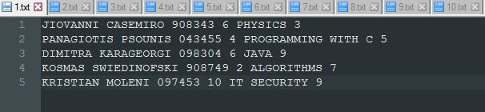
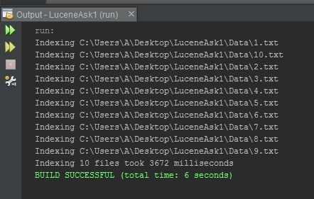
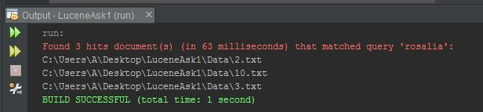
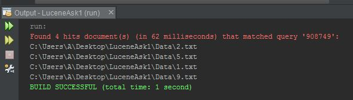
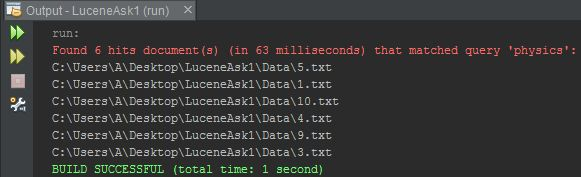

# Lucene-Indexer-And-Searcher
A Lucene 8.0.0 API based java application example of an indexer and a searcher.

Ten `.txt` files (`1.txt` - `10.txt`), located in the `Data` directory, each with five records of a student's name, surname, registration number, semester, course and grade that are the input of the index that's soon to be created and stored under the `Index` directory, just so the user can search it up and find out which files contain a given search term. 

## Indexer
For the `Indexer` class, the execution is as follows:

**`java indexer_and_searcher.Indexer <index dir> <data dir>`**

where `<index dir>` is the `Index` directory and `<data dir>` is the `Data` directory.

## Searcher
For the `Searcher` class, the execution is as follows:

**`java indexer_and_searcher.Searcher <index dir> <query>`**

where `<index dir>` is the `Index` directory and `<query>` is the search term given by the user.

Essential Lucene 8.0.0 API `.jar` files included.
